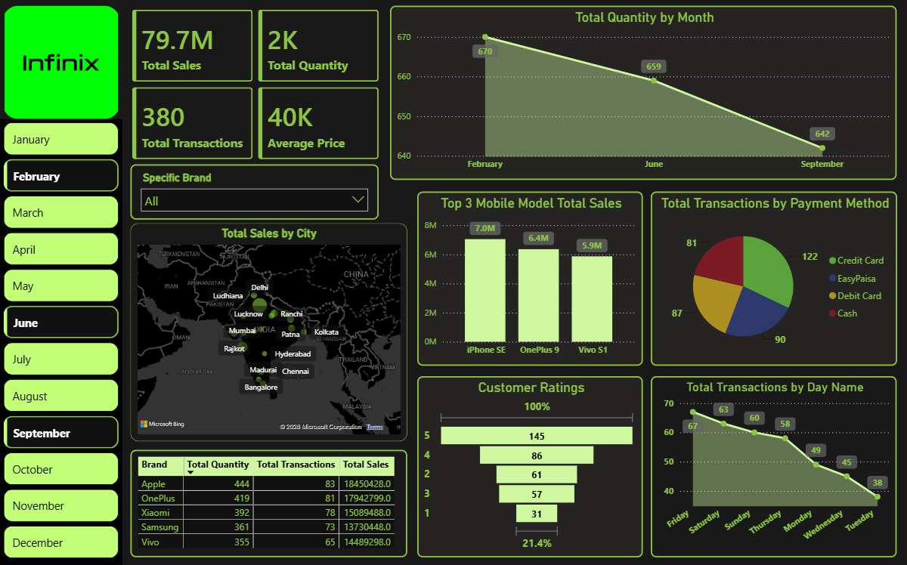

# Mobile Sales & Customer Insights Dashboard (Power BI)

## Project Overview
This project involves transforming a raw transactional dataset of mobile phone sales into an interactive, executive-ready Business Intelligence dashboard. The analysis covers deep sales performance tracking, monthly volume trends, device popularity, transactional distributions by day and payment method, and customer sentiment analytics.

## Data Schema & Fields Covered
The underlying dataset was structured across the following transactional variables:
* **Identifiers:** Transaction ID, Customer Name, Customer Age
* **Temporal Data:** Day, Month, Year, Day Name
* **Product Details:** Brand, Mobile Model, Price Per Unit, Units Sold
* **Geographical & Operational Fields:** City, Payment Method, Customer Ratings

---

## Core Technical Transformations (ETL & DAX)
To take this from raw Excel data to a dynamic reporting system, the following engineering steps were executed:
* **Power Query ETL:** Handled data type conversions, standardized text values, removed null anomalies, and engineered a clean schema for smooth chart interactions.
* **DAX & Modeling:** Formulated explicit measures to handle key business metrics including Total Sales (Revenue), Total Quantity Sold, Total Unique Transactions, and Average Price tracking.
* **UI/UX Design:** Designed a high-contrast dark theme optimized for clarity, using visual hierarchy to group KPIs on the left, time-series analysis at the top, and structural breakdowns across the lower quadrant.

---

## Dashboard Preview

---

## Key Business Insights & Features

### 1. High-Level Operational KPIs
* **Top-Line Revenue:** Total global sales reached **79.7M** across **380 individual transactions**.
* **Volume & Pricing:** A total of **2K units** were shifted at an average market price point of **40K** per unit.

### 2. Market Share & Product Performance
* **Brand Leadership:** The core data grid highlights Apple as the volume leader with 444 units sold (generating 18.4M in revenue), closely followed by OnePlus and Xiaomi.
* **Model Breakdown:** The **iPhone SE** stands out as the single highest revenue-generating handset model, securing 7.0M in sales independently.

### 3. Customer Habits & Payment Preferences
* **Payment Splitting:** Credit Cards represent the most frequent transaction highway (122 transactions), closely followed by regional mobile wallets like **EasyPaisa** (90 transactions) and Debit Cards (87 transactions).
* **Feedback Distribution:** The customer sentiment funnel reveals a highly positive retention rate, with the vast majority of buyers rating their purchase experience at a full 5 stars.
